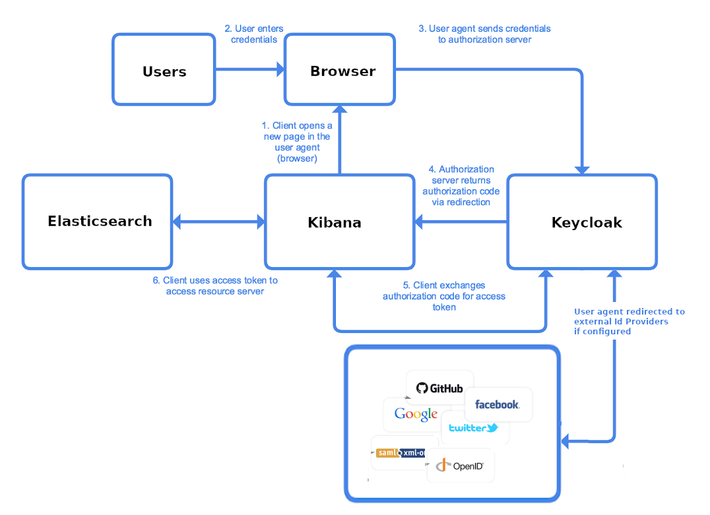

#### Kibana Authentication Flow

#### Kibana Authorization Flow
Opendistro Security architecture is compatible with a single Kibana instance for several users :
 -  Each user is linked to a role
 -  Each role is allowed to process actions on indices
 -  Each role can be configured to filter queries on documents, but also on fields

Thus, each role has its own level of access to Elasticsearch data.
Furthermore, Opendistro Security provides a Kibana plugin for tenant-based access control for dashboards data :
-   Each role can be linked to a tenant(workspace)
-   Each tenant(workspace) has permissions to read or write permissions on index patterns, visualizations and dashboards
-   Each tenant(workspace) can be shared between multiple roles
-   Each role sharing a tenant can access to the same dashboards
- There are two pre-defined "workspaces" for each user: ****Global**** and ****Private****. 
Workspace includes saved index patterns, visualizations and dashboards. User may select "workspace" in "tenant"  menu. 
Everything created and configured in ****Global**** workspace will be available to all authenticated users. 
****Private**** workspace is accessible by users themselves

**Kibana Configuration**:
There are two ways to configure security plugin: through Kibana GUI and using API calls
Initial configuration may be set by placing  ***internal_users.yml, roles.yml, roles_mapping.yml, action_groups.yml and tenants.yml*** [files](https://opendistro.github.io/for-elasticsearch-docs/docs/security-configuration/yaml/) to *** /usr/share/elasticsearch/plugins/opendistro_security/securityconfig/*** directory of elasticsearch node. During plugin initialization phase information from these files will be imported into security plugin index of Elasticsearch db. 
Using [API](https://opendistro.github.io/for-elasticsearch-docs/docs/security-access-control/api/) we may be able to perform ALL the same configuration changes as through GUI. The easiest way to deal with new tenants will  be to perform GUI configuration of new role, role_mapping, tenant and role permissions and than using API get configuration json data from Elasticsearch. After that based on collected data use API to add configuration for new tenant, add user's email to particular role_mapping when new user arrive and so on