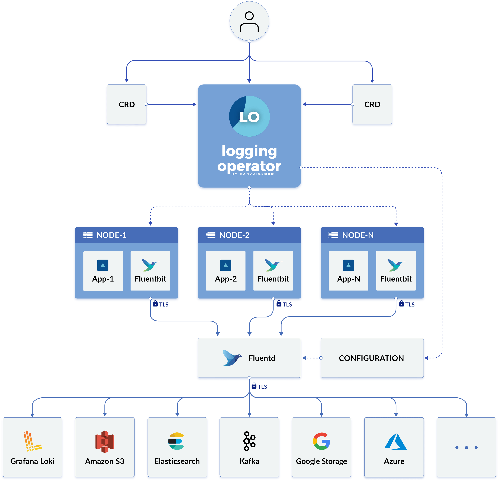

#### Logging Operator 

****Feature highlights****
-    Namespace isolation
-   Native Kubernetes label selectors
-    Secure communication (TLS)
-    Configuration validation
-    Multiple flow support (multiply logs for different transformations)
-    Multiple output support (store the same logs in multiple storage: S3, GCS, ES, Loki and more...)
-    Multiple logging system support (multiple fluentd, fluent-bit deployment on the same cluster)

You can configure the Logging operator using the following Custom Resource Descriptions.
-    logging - Represents a logging system. Includes Fluentd and Fluent-bit configuration. Specifies the controlNamespace. Fluentd and Fluent-bit will be deployed in the controlNamespace
-    output - Defines an Output for a logging flow. This is a namespaced resource. Output may be used only by flows in the same namespace.
-    clusteroutput - Defines an output without namespace restriction. Only effective in controlNamespace. May be used by any flow/clusterflow regardless namespace location.
-    flow - Defines a logging flow with filters and outputs. You can specify selectors to filter logs by labels. Outputs can be output or clusteroutput. This is a namespaced resource.Container log may be selected/excluded based on pod labels, hosts or/and container names
-    clusterflow - Defines a logging flow without namespace restriction. Container log may be selected/excluded based on namespaces, pod labels, hosts or/and container names
See the [detailed CRD documentation.](https://banzaicloud.com/docs/one-eye/logging-operator/crds/)

#### Logging Operator Flow

